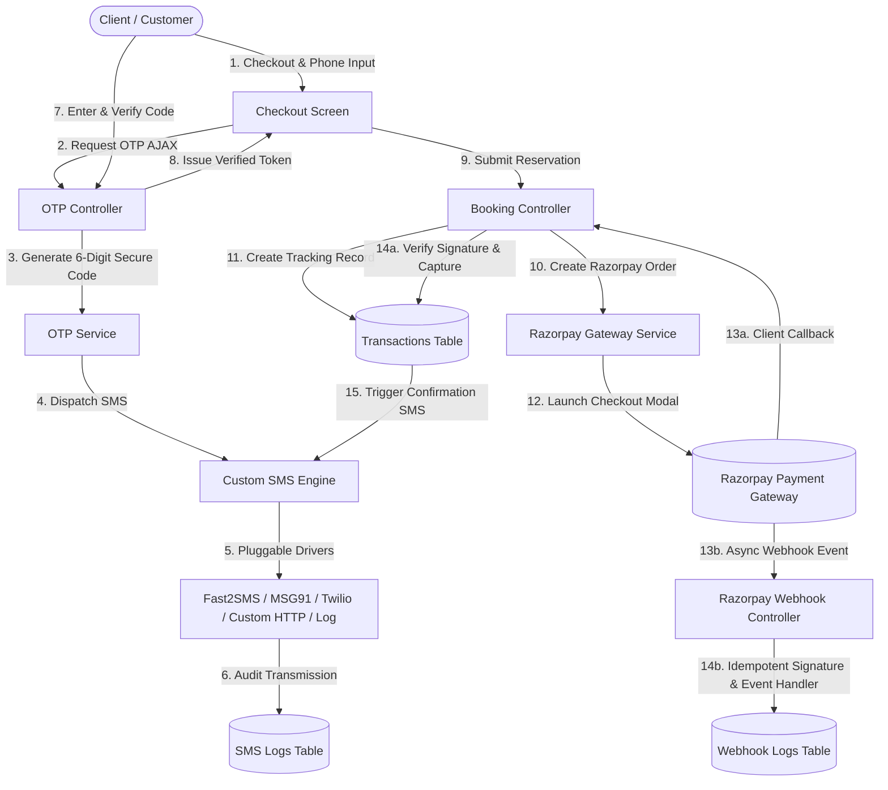

# 📸 Lumina Studio & Productions — Luxury Photoshoot Platform

A production-ready, ultra-premium, enterprise-grade Photoshoot Studio web application built with **Laravel 11**, **TailwindCSS**, **Alpine.js**, **MySQL**, **Razorpay Payment Gateway**, **Transaction Tracking**, **OTP Verification**, **Multi-Driver Custom SMS Engine**, and **Resilient Asynchronous Webhooks**.

---

## 🌟 Architecture & Enterprise Modules



---

## 💳 1. Razorpay Payment Gateway & Transaction Tracking

- **Full Payment Lifecycle Tracking**:
  - Automatically generates unique tracking reference codes (e.g. `TRX-66C0F8A91B`).
  - Tracks states: `initiated`, `pending_otp`, `otp_verified`, `processing`, `captured`, `failed`, `refunded`.
  - Stores complete payment identifiers (`razorpay_order_id`, `razorpay_payment_id`, `razorpay_signature`), failure reasons, client IP address, and raw gateway JSON response payloads.
- **Dual Checkout Modes**:
  - **Live / Test Gateway Mode**: Standard Razorpay checkout popup with prefilled client details, amount in paise, and SHA256 signature verification.
  - **1-Click Sandbox Simulation Mode**: Enables instant development and demonstration testing without live API keys.
- **Admin Transaction Tracking Inspector**:
  - Dedicated Super Admin tab with status filtering (`Captured`, `Initiated`, `Failed`, `Refunded`), keyword search, and JSON inspector modal.
- **Client Transaction History**:
  - Client portal displays live transaction reference codes, payment IDs, status badges, and printable receipts.

---

## 📱 2. Secure Phone OTP Verification

- **Rate-Limited OTP Engine**:
  - Generates cryptographically secure 6-digit numeric verification codes.
  - 10-minute expiry window with a maximum limit of 5 verification attempts.
  - 60-second cooldown timer between resend requests.
- **Interactive Checkout UI**:
  - Seamless AJAX verification box with live countdown timer and auto-resend controls.
  - Generates secure authorization token (`otp_token`) required upon booking submission.
  - Development mode auto-fills simulated OTP for rapid testing.

---

## 📨 3. Multi-Driver Custom SMS Engine

- **Extensible Pluggable Architecture (`App\Services\Sms`)**:
  - **`Fast2SmsDriver`**: Indian Quick SMS / DLT route.
  - **`Msg91Driver`**: Enterprise MSG91 Flow API with customizable Sender ID header.
  - **`TwilioDriver`**: Global International SMS via E.164 phone formatting.
  - **`CustomHttpDriver`**: Generic webhook / HTTP GET & POST URL gateway supporting dynamic `{phone}` and `{message}` placeholders.
  - **`LogDriver`**: Zero-dependency local development and simulation logger.
- **Customizable Message Templates**:
  - Configurable via Admin Dashboard with dynamic placeholder tags:
    - `{site_name}`: Studio brand name.
    - `{currency}`: Active currency symbol (`₹`, `$`, etc.).
    - `{name}`: Client full name.
    - `{amount}`: Formatted transaction amount.
    - `{booking_id}`: Booking identifier.
    - `{package}`: Name of photoshoot package.
    - `{payment_id}`: Razorpay payment identifier.
    - `{otp}`: 6-digit verification code.
    - `{reason}`: Failure reason description.
    - `{retry_url}`: Direct checkout retry link.
- **Admin SMS Tools & Delivery Audit Logs**:
  - Interactive **"Send Test SMS"** diagnostic tool in the Admin Panel.
  - Full audit logging in `sms_logs` table tracking recipient, driver, message, status, and API response payload.

---

## 🪝 4. Razorpay Webhooks & Asynchronous Resilience

- **Dedicated Webhook Endpoints**:
  - Endpoint: `POST /razorpay/webhook` (Alias: `POST /webhooks/razorpay`).
  - Exempted from CSRF in `bootstrap/app.php`.
- **Cryptographic Security**:
  - HMAC SHA256 webhook signature verification against `RAZORPAY_WEBHOOK_SECRET`.
- **Idempotency & Replay Protection**:
  - Prevents duplicate booking updates or double-crediting if Razorpay re-transmits events.
- **Supported Webhook Events**:
  - `payment.captured` & `order.paid`: Updates booking to completed/in-progress, updates transaction to `captured`, and triggers confirmation SMS.
  - `payment.failed`: Records error code/description, marks transaction as `failed`, and sends alert SMS with retry link.
  - `payment.authorized`: Updates transaction status to `processing`.
  - `refund.created` & `refund.processed`: Updates transaction and booking status to `refunded`.
- **Admin Webhook Monitoring Tab**:
  - 1-Click Webhook URL copy helper.
  - Real-time inbound webhook event stream with JSON payload inspector.

---

## 🎨 5. Dynamic Themes & SEO Management

- **Real-Time Theme Engine**:
  - Full canvas background customizer (`bg_color`) and dynamic palette pickers.
  - 6 One-Click Presets: *Luxury Gold*, *Obsidian Neon*, *Royal Emerald*, *Rose Champagne*, *Cyberpunk Violet*, *Clean Light*.
- **Structured Schema & SEO**:
  - Automated JSON-LD `PhotographyStudio` and `LocalBusiness` structured markup.
  - Dynamic XML sitemap at `/sitemap.xml` and robots directive at `/robots.txt`.

---

## 🔑 Default Seed Credentials

After running `php artisan migrate --seed`, use the following accounts:

| Role | Email | Password | Dashboard URL |
|---|---|---|---|
| **Super Admin** | `admin@studio.test` | `password` | `/admin/dashboard` |
| **Photographer / Vendor** | `vendor@studio.test` | `password` | `/vendor/dashboard` |
| **Client** | `client@studio.test` | `password` | `/client/dashboard` |

---

## 🛠️ Installation & Setup Instructions

### Step 1: Open Project Directory
```bash
cd c:\xampp\htdocs\vk\Studio
```

### Step 2: Configure `.env`
```env
APP_NAME="Lumina Studio"
APP_URL=http://127.0.0.1:8000

DB_CONNECTION=mysql
DB_HOST=127.0.0.1
DB_PORT=3306
DB_DATABASE=your_database_name
DB_USERNAME=root
DB_PASSWORD=

# Razorpay Payment Gateway Credentials (Optional: Simulation mode works out of the box)
RAZORPAY_KEY_ID=rzp_test_xxxxxx
RAZORPAY_KEY_SECRET=xxxxxx
RAZORPAY_WEBHOOK_SECRET=xxxxxx
```

### Step 3: Run Migrations
```bash
php artisan migrate
```

### Step 4: Start Local Server
```bash
php artisan serve
```
Visit: `http://127.0.0.1:8000`

---

## 🗄️ Database Tables Overview

- `transactions`: Full payment lifecycle tracking (`transaction_ref`, `booking_id`, `user_id`, `amount`, `status`, `payment_method`, `razorpay_order_id`, `razorpay_payment_id`, `razorpay_signature`, `customer_name`, `customer_email`, `customer_phone`, `raw_response`).
- `otp_verifications`: Phone & email OTP verification records (`phone`, `email`, `otp_code`, `token`, `status`, `attempts`, `expires_at`, `verified_at`).
- `sms_logs`: Delivery audit records for all outbound SMS (`recipient`, `message`, `driver`, `template_key`, `status`, `response_payload`).
- `webhook_logs`: Inbound Razorpay webhook event stream (`event_id`, `event_type`, `signature`, `is_valid_signature`, `processed`, `payload`).
- `bookings`: Studio session reservations with dates, notes, and workflow statuses.
- `packages`: Photography packages and tier deliverables.
- `settings`: Dynamic system configurations, themes, and SMS templates.
- `users`: User authentication accounts and roles (`super_admin`, `vendor`, `client`).
