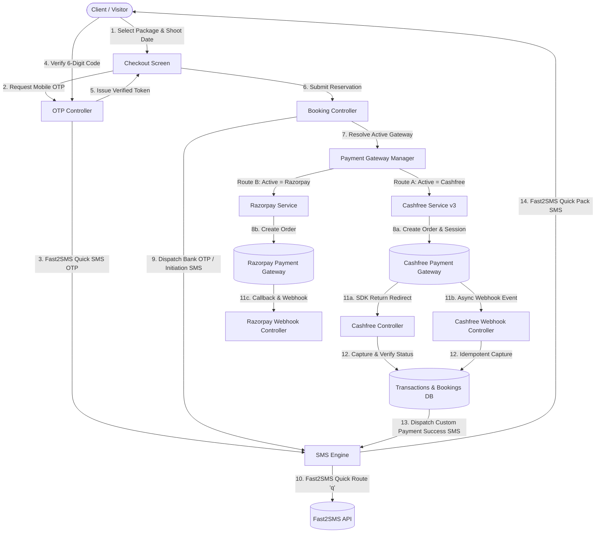
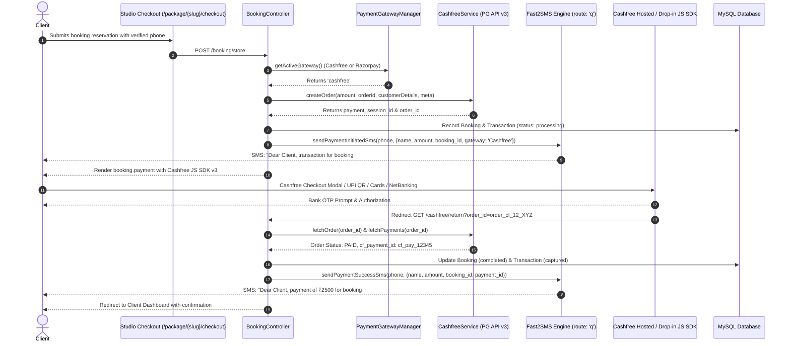
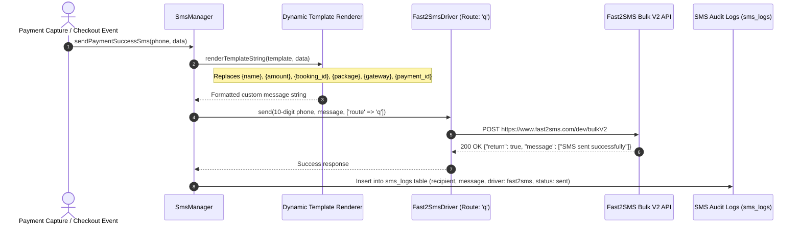

# 📸 Middukhera Studio & Productions — Luxury Photoshoot & Production Management Platform

A high-performance, enterprise-grade Photoshoot & Cinematography Studio web application built with **Laravel 12 / PHP 8.4**, **TailwindCSS v4**, **Alpine.js**, **MySQL**, **Cashfree PG v3 Gateway**, **Razorpay Payment Gateway**, **Multi-Gateway Payment Switcher**, **Fast2SMS Quick SMS Pack Engine with Dynamic Message Templates**, **Phone OTP Verification**, **Package & Booking Management**, **Responsive Executive Sidebar Dashboard**, and **Resilient Asynchronous Webhooks**.

---

## 📑 Table of Contents

1. [🌟 Architecture & System Workflows](#-architecture--system-workflows)
   - [High-Level Booking, Payment & SMS Architecture](#1-high-level-booking-payment--sms-architecture)
   - [Payment Gateway Switcher & Cashfree Flow](#2-payment-gateway-switcher--cashfree-flow)
   - [Fast2SMS Quick Pack & Custom Template Workflow](#3-fast2sms-quick-pack--custom-template-workflow)
2. [✨ Key Features & Modules](#-key-features--modules)
   - [Cashfree Payment Gateway Integration (PG API v3)](#1-cashfree-payment-gateway-integration-pg-api-v3)
   - [Dynamic Payment Gateway Switcher (Cashfree vs Razorpay)](#2-dynamic-payment-gateway-switcher-cashfree-vs-razorpay)
   - [Fast2SMS Quick Pack & Custom Dynamic Templates](#3-fast2sms-quick-pack--custom-dynamic-templates)
   - [Executive Super Admin Dashboard](#4-executive-super-admin-dashboard)
   - [Phone OTP Verification & Security](#5-phone-otp-verification--security)
   - [Asynchronous Webhook Event Audit Logs](#6-asynchronous-webhook-event-audit-logs)
   - [Package & Portfolio Management](#7-package--portfolio-management)
   - [Vendor / Photographer Multi-Tenant System](#8-vendor--photographer-multi-tenant-system)
   - [Dynamic Theme Engine & JSON-LD Structured SEO](#9-dynamic-theme-engine--json-ld-structured-seo)
3. [📂 Project Structure & Directory Layout](#-project-structure--directory-layout)
4. [🛠️ Step-by-Step Installation & Local Setup](#️-step-by-step-installation--local-setup)
5. [⚙️ Complete Environment Configuration (`.env`)](#️-complete-environment-configuration-env)
6. [🔑 Default Seed Credentials](#-default-seed-credentials)
7. [📖 Operational Guides & How-To](#-operational-guides--how-to)
   - [How to Configure Cashfree in Admin Dashboard](#a-how-to-configure-cashfree-in-admin-dashboard)
   - [How to Switch Between Cashfree and Razorpay](#b-how-to-switch-between-cashfree-and-razorpay)
   - [How to Configure Fast2SMS Quick SMS Pack & Templates](#c-how-to-configure-fast2sms-quick-sms-pack--templates)
   - [How the Booking & Checkout Flow Works](#d-how-the-booking--checkout-flow-works)
   - [How to Test Cashfree & Razorpay Webhooks](#e-how-to-test-cashfree--razorpay-webhooks)
8. [🗄️ Database Schema & Data Models](#️-database-schema--data-models)
9. [🧪 Automated Testing & Verification](#-automated-testing--verification)
10. [🚀 Deployment & Production Optimizations](#-deployment--production-optimizations)
11. [❓ Troubleshooting & FAQ](#-troubleshooting--faq)

---

## 🌟 Architecture & System Workflows

### 1. High-Level Booking, Payment & SMS Architecture



---

### 2. Payment Gateway Switcher & Cashfree Flow



---

### 3. Fast2SMS Quick Pack & Custom Template Workflow



---

## ✨ Key Features & Modules

### 1. Cashfree Payment Gateway Integration (PG API v3)
- **Official PG API v3 Support**: Integrates `/pg/orders`, `/pg/orders/{order_id}`, and `/pg/orders/{order_id}/payments`.
- **Cashfree Web JS SDK v3**: Drop-in checkout modal supporting UPI, Cards, NetBanking, and Wallets.
- **Dual Environment Modes**: Instant toggle between `SANDBOX` (Test) and `PRODUCTION` (Live) modes.
- **HMAC-SHA256 Webhook Verification**: Cryptographic validation using `x-webhook-timestamp` and `x-webhook-signature` headers.
- **Instant Simulation / Sandbox Mode**: Allows end-to-end checkout and verification testing even before merchant credentials are live.

### 2. Dynamic Payment Gateway Switcher (Cashfree vs Razorpay)
- **Active Gateway Selector**: Choose between **Cashfree Payments** and **Razorpay** in the Admin panel with 1 click.
- **Independent Enable/Disable Toggles**: Enable or disable gateways individually.
- **Seamless Model Polymorphism**: `bookings`, `transactions`, and `payments` tables dynamically track `gateway`, `cashfree_order_id`, `cashfree_payment_id`, `razorpay_order_id`, and `payment_session_id`.

### 3. Fast2SMS Quick Pack & Custom Dynamic Templates
- **Fast2SMS Quick SMS Route (`q`)**: Optimized for instant delivery across Indian telecom operators.
- **Automatic Phone Number Sanitization**: Automatically normalizes phone numbers (`+91`, `91`, leading zeros) to valid 10-digit Indian mobile numbers.
- **Transaction Initiation & Bank OTP Notice SMS**: Notifies customer when checkout begins to watch for bank OTP.
- **Payment Success SMS**: Dispatches a custom confirmation message immediately upon payment capture.
- **Dynamic Placeholders**:
  - `{name}`: Client Full Name
  - `{amount}`: Booking / Transaction Amount
  - `{currency}`: Currency Symbol (e.g. ₹ / Rs.)
  - `{booking_id}`: Booking Number
  - `{package}`: Photography Package Name
  - `{gateway}`: Gateway Used (Cashfree / Razorpay)
  - `{payment_id}`: Transaction ID / Payment ID
  - `{site_name}`: Studio Brand Name
  - `{datetime}`: Timestamp
  - `{otp}`: 6-digit Verification Code
  - `{retry_url}`: Payment Retry URL
- **Live Test SMS Tool**: Admin diagnostic console to test Fast2SMS delivery instantly.
- **SMS Audit Trail**: Complete database logging in `sms_logs` table with status, driver, and payload.

### 4. Executive Super Admin Dashboard
- **Responsive Sticky Sidebar**: Full-height luxury dark sidebar with slide-over drawer on mobile and collapsible desktop toggle.
- **Isolated Dedicated Layout**: Clean workspace isolated from the public navigation and footer.
- **Dedicated Admin Sections**:
  - **Payment Gateways (`#gateways`)**: Active gateway selector, Cashfree PG keys, Razorpay keys, and webhook URLs.
  - **Fast2SMS & Templates (`#sms_settings`)**: Fast2SMS API key, Route 'q', template editors, and test dispatcher.
  - **Inbound Webhook Logs (`#webhooks`)**: Real-time event log viewer with JSON payload inspector.
  - **Bookings & Transactions (`#bookings`, `#transactions`)**: Real-time tracking and status management.
  - **Pricing Packages & Portfolio (`#packages`, `#gallery`)**: Live package and photo showcase CRUD.
  - **Theme & Colors (`#theme_settings`)**: Live palette customizer with 6 luxury presets.

### 5. Phone OTP Verification & Security
- **Cryptographic 6-Digit Codes**: 10-minute validity with secure hashing.
- **Brute-Force & Rate Limiting**: Max 5 attempts per token, 60-second cooldown timer.
- **Inline AJAX Verification Box**: Countdown timer, simulation auto-fill in development, and token issuance.

### 6. Asynchronous Webhook Event Audit Logs
- **Dedicated Webhook Endpoints**:
  - Cashfree: `POST /cashfree/webhook`
  - Razorpay: `POST /razorpay/webhook`
- **Idempotency & Replay Protection**: Eliminates duplicate charges or redundant updates.
- **Payload Inspector Modal**: View raw JSON payloads received from payment gateway webhooks.

### 7. Package & Portfolio Management
- **Package Editor**: Create and update package pricing tiers, deliverables checklist, descriptions, and cover photos.
- **Gallery Showcase**: Categorized portfolio items with direct image uploads.

### 8. Vendor / Photographer Multi-Tenant System
- **Vendor Signup & Portal**: Photographers can register at `/vendor/register` and manage custom packages at `/vendor/dashboard`.
- **Super Admin Moderation**: Review, approve, or suspend vendor accounts.

### 9. Dynamic Theme Engine & JSON-LD Structured SEO
- **Live Visual Customizer**: Real-time color palette customizer with instant preview.
- **6 One-Click Presets**: *Luxury Gold*, *Obsidian Neon*, *Royal Emerald*, *Rose Champagne*, *Cyberpunk Violet*, and *Clean Light*.
- **Structured Schema & Sitemap**: Automated JSON-LD for `PhotographyStudio` and dynamic `/sitemap.xml`.

---

## 📂 Project Structure & Directory Layout

```
Studio/
├── app/
│   ├── Http/
│   │   ├── Controllers/
│   │   │   ├── AdminDashboardController.php     # Admin metrics, settings, packages, SMS tests, theme presets
│   │   │   ├── BookingController.php            # Checkout, Cashfree & Razorpay order initiation
│   │   │   ├── CashfreeController.php           # Cashfree return redirect & client verification API
│   │   │   ├── CashfreeWebhookController.php    # Cashfree inbound webhook handler (HMAC verified)
│   │   │   ├── ClientDashboardController.php    # Client booking history & printable receipts
│   │   │   ├── FrontendController.php           # Public homepage, gallery, blogs, contact, policies
│   │   │   ├── OtpController.php                # AJAX OTP send, verify, and resend endpoints
│   │   │   ├── RazorpayWebhookController.php    # Razorpay HMAC-verified webhook handler
│   │   │   ├── SitemapController.php            # Dynamic XML sitemap generator
│   │   │   ├── VendorDashboardController.php    # Vendor analytics & session manager
│   │   │   ├── VendorPackageController.php      # Vendor custom package CRUD
│   │   │   └── VendorRegistrationController.php # Vendor signup and onboard flow
│   │   └── Middleware/
│   │       └── EnsureAdmin.php                  # Super Admin role authorization gate
│   ├── Models/
│   │   ├── Blog.php                             # Masterclass editorial articles
│   │   ├── Booking.php                          # Photoshoot appointments, gateway refs, workflow state
│   │   ├── ContactMessage.php                   # Public inquiries
│   │   ├── Gallery.php                          # Portfolio images & category tags
│   │   ├── OtpVerification.php                  # 6-digit phone verification tokens
│   │   ├── Package.php                          # Photography packages & pricing
│   │   ├── Payment.php                          # Multi-gateway payment records
│   │   ├── Setting.php                          # Key-value dynamic system configuration
│   │   ├── SmsLog.php                           # Delivery audit trail for SMS dispatches
│   │   ├── Transaction.php                      # Full payment lifecycle, Cashfree & Razorpay metadata
│   │   ├── User.php                             # User accounts (super_admin, vendor, client)
│   │   ├── Vendor.php                           # Photographer partner profile
│   │   ├── Visitor.php                          # Analytics visitor tracker
│   │   └── WebhookLog.php                       # Inbound webhook payload logs
│   └── Services/
│       ├── Otp/
│       │   └── OtpService.php                   # OTP generation, verification, and rate limiting
│       ├── Payment/
│       │   ├── CashfreeService.php              # Cashfree PG API v3 client, orders, webhook validation
│       │   ├── PaymentGatewayManager.php        # Dynamic gateway resolver (Cashfree vs Razorpay)
│       │   └── RazorpayService.php              # Razorpay API client, orders, signature verification
│       └── Sms/
│           ├── Contracts/
│           │   └── SmsGatewayInterface.php      # Driver interface contract
│           ├── Drivers/
│           │   ├── AutoFailoverDriver.php       # Multi-gateway failover driver
│           │   ├── CustomHttpDriver.php         # Generic HTTP webhook driver
│           │   ├── Fast2SmsDriver.php           # Fast2SMS Quick pack driver (Route: 'q', 10-digit Indian)
│           │   ├── LogDriver.php                # Local file logger driver
│           │   ├── Msg91Driver.php              # MSG91 Flow API driver
│           │   └── TwilioDriver.php             # Twilio SMS gateway driver
│           └── SmsManager.php                   # SMS dispatcher & dynamic template rendering engine
├── bootstrap/
│   └── app.php                                  # Application config, routing, CSRF exemptions
├── config/
│   ├── database.php                             # Database connections
│   ├── services.php                             # Service credentials (Cashfree, Razorpay, Fast2SMS, Twilio)
│   └── sms.php                                  # Default SMS drivers & templates
├── database/
│   ├── migrations/
│   │   ├── 0001_01_01_000000_create_users_table.php
│   │   ├── 2026_08_11_000000_create_photoshoot_studio_tables.php
│   │   ├── 2026_08_11_100000_create_vendors_and_update_packages.php
│   │   ├── 2026_08_14_190241_create_settings_table.php
│   │   ├── 2026_08_21_000000_create_transactions_otp_sms_webhook_tables.php
│   │   └── 2026_09_15_000000_add_cashfree_and_gateway_columns.php
│   └── seeders/
│       └── DatabaseSeeder.php                   # Default settings, packages, blogs, users
├── resources/
│   ├── css/
│   │   └── app.css                              # TailwindCSS v4 theme variables
│   └── views/
│       ├── admin/
│       │   └── dashboard.blade.php              # Executive admin dashboard with Gateways & Fast2SMS tabs
│       ├── booking/
│       │   ├── checkout.blade.php               # Luxury checkout screen with OTP verification
│       │   └── payment.blade.php                # Multi-gateway payment view (Cashfree SDK v3 / Razorpay)
│       ├── client/
│       │   └── dashboard.blade.php              # Client reservations & transaction receipts
│       ├── frontend/
│       │   ├── about.blade.php
│       │   ├── blog.blade.php
│       │   ├── contact.blade.php
│       │   ├── gallery.blade.php
│       │   ├── home.blade.php                   # Landing page with hero, packages & reviews
│       │   └── policies.blade.php               # Terms, Privacy, Refund, Shipping compliance
│       ├── layouts/
│       │   ├── app.blade.php                    # Master layout with conditional admin separation
│       │   ├── footer.blade.php                 # Public footer
│       │   └── navigation.blade.php             # Public luxury navigation bar
│       └── vendor/
│           └── dashboard.blade.php              # Vendor dashboard
├── routes/
│   ├── auth.php                                 # Authentication routes (Breeze)
│   └── web.php                                  # Main web, API, Cashfree, and Webhook routes
└── tests/
    └── Feature/
        ├── Auth/                                # User authentication tests
        ├── PackageManagementTest.php            # Package CRUD & update tests
        └── SmsGatewayTest.php                   # SMS gateway & template tests
```

---

## 🛠️ Step-by-Step Installation & Local Setup

### Prerequisites
- **PHP**: `^8.2` or `^8.4` (with `pdo_mysql`, `curl`, `mbstring`, `openssl`, `fileinfo` enabled)
- **Composer**: `^2.x`
- **Node.js**: `^18.x` or `^20.x` & **NPM**
- **MySQL / MariaDB**: `^8.0` / `^10.4` (e.g. via XAMPP)

---

### Step 1: Clone or Open Project Directory
```bash
cd c:\xampp\htdocs\vk\Studio
```

### Step 2: Install PHP Dependencies
```bash
composer install
```

### Step 3: Install Frontend Node Dependencies & Compile Assets
```bash
npm install
npm run build
```
*(For active local development with hot reload, run `npm run dev` in a separate terminal).*

### Step 4: Configure Environment File
```bash
cp .env.example .env
php artisan key:generate
```

### Step 5: Configure Database Connection in `.env`
```env
DB_CONNECTION=mysql
DB_HOST=127.0.0.1
DB_PORT=3306
DB_DATABASE=studio
DB_USERNAME=root
DB_PASSWORD=
```

### Step 6: Run Database Migrations & Seed Data
```bash
php artisan migrate --seed
```

### Step 7: Create Public Storage Symlink
```bash
php artisan storage:link
```

### Step 8: Start the Local Development Server
```bash
php artisan serve
```
Open your browser and visit: `http://127.0.0.1:8000`

---

## ⚙️ Complete Environment Configuration (`.env`)

```env
# ==============================================================================
# APPLICATION SETTINGS
# ==============================================================================
APP_NAME="Middukhera Studio & Productions"
APP_ENV=local
APP_KEY=base64:...
APP_DEBUG=true
APP_TIMEZONE=Asia/Kolkata
APP_URL=http://127.0.0.1:8000

# ==============================================================================
# DATABASE CONFIGURATION
# ==============================================================================
DB_CONNECTION=mysql
DB_HOST=127.0.0.1
DB_PORT=3306
DB_DATABASE=studio
DB_USERNAME=root
DB_PASSWORD=

# ==============================================================================
# ACTIVE PAYMENT GATEWAY SELECTOR
# Options: cashfree | razorpay
# ==============================================================================
ACTIVE_PAYMENT_GATEWAY=cashfree

# ==============================================================================
# CASHFREE PAYMENT GATEWAY (PG API v3)
# ==============================================================================
CASHFREE_ENABLED=1
CASHFREE_ENVIRONMENT=SANDBOX              # Options: SANDBOX | PRODUCTION
CASHFREE_APP_ID=TEST_SAMPLE_APP_ID        # From Cashfree Merchant Dashboard
CASHFREE_SECRET_KEY=your_cashfree_secret  # From Cashfree Merchant Dashboard
CASHFREE_WEBHOOK_SECRET=your_wh_secret    # From Cashfree Webhooks Dashboard
CASHFREE_API_VERSION=2023-08-01
CASHFREE_SIMULATION_MODE=1                # Set 0 for live Cashfree SDK / 1 for instant sandbox test

# ==============================================================================
# RAZORPAY PAYMENT GATEWAY
# ==============================================================================
RAZORPAY_ENABLED=1
RAZORPAY_SIMULATION_MODE=1
RAZORPAY_KEY_ID=rzp_test_sample
RAZORPAY_KEY_SECRET=your_razorpay_secret
RAZORPAY_WEBHOOK_SECRET=your_webhook_secret

# ==============================================================================
# FAST2SMS QUICK SMS PACK & SMS GATEWAY
# Options: fast2sms | auto | twilio | msg91 | custom_http | simulation
# ==============================================================================
SMS_ENABLED=1
SMS_DRIVER=fast2sms

# Gateway: Fast2SMS (Quick SMS Pack for India)
FAST2SMS_API_KEY=your_fast2sms_api_key    # From fast2sms.com
FAST2SMS_ROUTE=q                          # Route 'q' (Quick SMS)
FAST2SMS_SENDER_ID=FSTSMS
FAST2SMS_ENTITY_ID=

# Gateway: Twilio (Optional International Gateway)
TWILIO_ACCOUNT_SID=ACXXXXXXXXXXXXXXXXXXXXXXXXXXXXXXXX
TWILIO_AUTH_TOKEN=your_twilio_auth_token
TWILIO_FROM_NUMBER=+1234567890

# Gateway: MSG91 (Optional Enterprise Gateway)
MSG91_AUTH_KEY=
MSG91_SENDER_ID=MIDDUK
MSG91_DLT_TEMPLATE_ID=
```

---

## 🔑 Default Seed Credentials

| Role | Email Address | Default Password | Dashboard URL |
| :--- | :--- | :--- | :--- |
| **Super Admin** | `admin@middukhera.com` | `password` | `/admin/dashboard` |
| **Photographer Vendor** | `vendor@middukhera.com` | `password` | `/vendor/dashboard` |
| **Client / Customer** | `client@middukhera.com` | `password` | `/client/dashboard` |

---

## 📖 Operational Guides & How-To

### a. How to Configure Cashfree in Admin Dashboard
1. Log in to `/admin/dashboard` as Super Admin.
2. In the sidebar, click on **Payment Gateways**.
3. Under **Active Payment Gateway Selector**, choose **Cashfree Payments**.
4. In the **Cashfree PG v3 Configuration** card:
   - Toggle **Enable Cashfree** to `Enabled`.
   - Set Environment Mode to `SANDBOX` (for testing) or `PRODUCTION` (for live).
   - Enter your **Cashfree App ID** and **Cashfree Secret Key**.
   - Set **Instant Simulation Mode** to `Disabled` when testing with real Cashfree test cards/UPI, or `Active` for instant mock tests.
5. Copy the **Cashfree Webhook URL** (`https://yourdomain.com/cashfree/webhook`) and paste it into your [Cashfree Merchant Dashboard](https://merchant.cashfree.com) under **Developers &rarr; Webhooks**.
6. Click **Save Payment Gateway Configurations**.

---

### b. How to Switch Between Cashfree and Razorpay
- In `/admin/dashboard` &rarr; **Payment Gateways**:
  - Click the **Cashfree Payments** card to use Cashfree PG.
  - Or click the **Razorpay Secure Gateway** card to switch to Razorpay.
- Click **Save Payment Gateway Configurations**.
- The checkout screen will instantly adapt to the selected active gateway.

---

### c. How to Configure Fast2SMS Quick SMS Pack & Templates
1. In `/admin/dashboard`, navigate to **Fast2SMS & Templates**.
2. Select Active Driver: **⭐ Fast2SMS (Quick SMS Pack)**.
3. Enter your **Fast2SMS Authorization API Key** from [fast2sms.com](https://www.fast2sms.com).
4. Set SMS Route to **Quick SMS (q)**.
5. Customize your message templates:
   - **Payment Initiated / Bank OTP Notice SMS Template**:
     ```
     Dear {name}, transaction of {currency}{amount} for booking #{booking_id} ({package}) has been initiated via {gateway}. Please enter the OTP sent by your bank to authorize the payment. - {site_name}
     ```
   - **Payment Success SMS Template**:
     ```
     Dear {name}, payment of {currency}{amount} for booking #{booking_id} ({package}) was successful! Txn ID: {payment_id} via {gateway}. Thank you - {site_name}.
     ```
6. Enter an **Admin Notification Mobile Number** to receive alerts on new bookings.
7. Use the **Send Test SMS** box to test sending an SMS to your 10-digit Indian mobile number.
8. Click **Save Fast2SMS Settings & Message Templates**.

---

### d. How the Booking & Checkout Flow Works
1. Client browses packages on `/` and clicks **Reserve Session**.
2. On `/package/{slug}/checkout`:
   - Client enters mobile number and clicks **Verify via OTP**.
   - Fast2SMS dispatches a 6-digit verification code.
   - Client verifies OTP.
3. Client selects shoot date and clicks **Proceed to Gateway**.
4. System initiates payment on Cashfree (or Razorpay) and sends a **Transaction Initiation SMS** to the client.
5. On the payment page:
   - Cashfree Web JS SDK v3 opens the secure payment modal.
   - Client completes payment via UPI, Debit/Credit Card, or NetBanking.
6. Upon payment confirmation:
   - Client is redirected to `/cashfree/return`.
   - Booking is marked `completed`, Transaction is marked `captured`.
   - Fast2SMS immediately sends the **Payment Success Confirmation SMS**.
   - Admin receives an SMS alert.

---

### e. How to Test Cashfree & Razorpay Webhooks
1. In development, use a webhook forwarding tool like [ngrok](https://ngrok.com) or [localtunnel](https://localtunnel.me):
   ```bash
   ngrok http 8000
   ```
2. Set your Cashfree webhook URL in Cashfree dashboard to:
   ```
   https://your-subdomain.ngrok-free.app/cashfree/webhook
   ```
3. When Cashfree triggers events (`PAYMENT_SUCCESS_WEBHOOK`, `ORDER_PAID_SUCCESS`), view them in real time in Admin Dashboard &rarr; **Webhook Event Logs** (`#webhooks`).

---

## 🗄️ Database Schema & Data Models

| Table | Purpose | Key Columns |
| :--- | :--- | :--- |
| `users` | User accounts & roles | `id`, `name`, `email`, `phone`, `role` (`admin`, `vendor`, `client`), `password` |
| `packages` | Studio photoshoot tiers | `id`, `name`, `slug`, `price_min`, `price_max`, `description`, `features` (JSON), `image_path` |
| `bookings` | Client appointments | `id`, `user_id`, `package_id`, `booking_date`, `status`, `payment_status`, `amount`, `customer_phone`, `payment_gateway`, `cashfree_order_id`, `cashfree_payment_id`, `razorpay_order_id`, `razorpay_payment_id` |
| `transactions` | Real-time payment ledger | `id`, `transaction_ref`, `booking_id`, `user_id`, `amount`, `currency`, `gateway`, `status`, `payment_method`, `cashfree_order_id`, `cashfree_payment_id`, `payment_session_id`, `razorpay_order_id`, `raw_response` (JSON) |
| `payments` | Captured payment records | `id`, `booking_id`, `payment_gateway`, `gateway_order_id`, `gateway_payment_id`, `amount`, `status`, `payment_method`, `raw_payload` (JSON) |
| `otp_verifications` | Phone verification state | `id`, `phone`, `email`, `otp_code`, `token`, `status`, `attempts`, `expires_at`, `verified_at` |
| `sms_logs` | SMS delivery audit trail | `id`, `recipient`, `message`, `driver`, `template_key`, `status` (`sent`, `simulated`, `failed`), `response_payload` |
| `webhook_logs` | Inbound webhook audit | `id`, `event_id`, `event_type`, `signature`, `is_valid_signature`, `processed`, `status_message`, `payload` (JSON) |
| `settings` | Dynamic site config | `id`, `key`, `value` |

---

## 🧪 Automated Testing & Verification

Run the test suite using Artisan or PHPUnit:

```bash
# Run all feature and unit tests
php artisan test

# Verify all routes are registered
php artisan route:list

# Check PHP syntax across payment and SMS services
php -l app/Services/Payment/CashfreeService.php
php -l app/Services/Payment/PaymentGatewayManager.php
php -l app/Http/Controllers/CashfreeController.php
php -l app/Services/Sms/SmsManager.php
```

---

## 🚀 Deployment & Production Optimizations

When deploying to a production server (Ubuntu / Nginx / Apache / cPanel / Forge):

```bash
# 1. Optimize configuration and routes
php artisan config:cache
php artisan route:cache
php artisan view:cache

# 2. Run latest migrations
php artisan migrate --force

# 3. Create storage symlink
php artisan storage:link

# 4. Build minified frontend assets
npm run build
```

---

## ❓ Troubleshooting & FAQ

#### Q1: How do I switch to Cashfree Live Production mode?
> **Answer**: In `/admin/dashboard` &rarr; **Payment Gateways**, select `PRODUCTION` under Environment Mode, paste your live Cashfree App ID and Secret Key, set Simulation Mode to `Disabled`, and save.

#### Q2: Why is Fast2SMS not delivering SMS to my phone?
> **Answer**:
> 1. Ensure you have entered a valid API Key in `/admin/dashboard` &rarr; **Fast2SMS & Templates**.
> 2. Ensure your Fast2SMS account has active Quick SMS wallet balance.
> 3. Verify that your recipient number is a valid 10-digit Indian mobile number.
> 4. Use the **Send Test SMS** box in the admin dashboard to check the exact Fast2SMS API response.

#### Q3: Does Cashfree work without live credentials in development?
> **Answer**: Yes! Set **Instant Simulation Mode** to `Active` in the Payment Gateways settings. Checkout will provide a 1-click simulation button that tests the entire flow, updates database records, and triggers Fast2SMS alerts.

---

**© Middukhera Studio & Productions. All Rights Reserved.**
