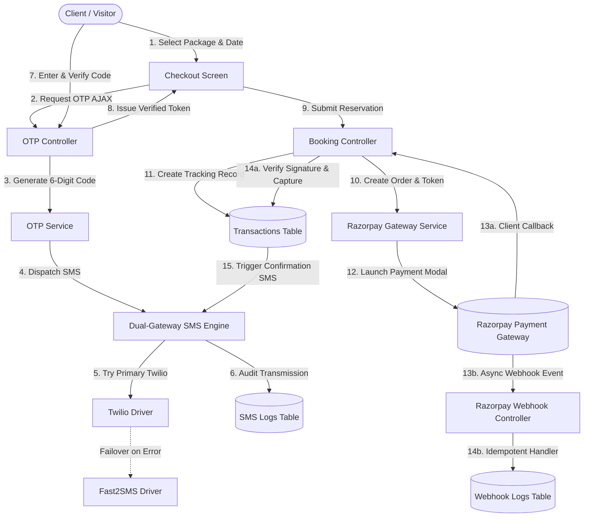
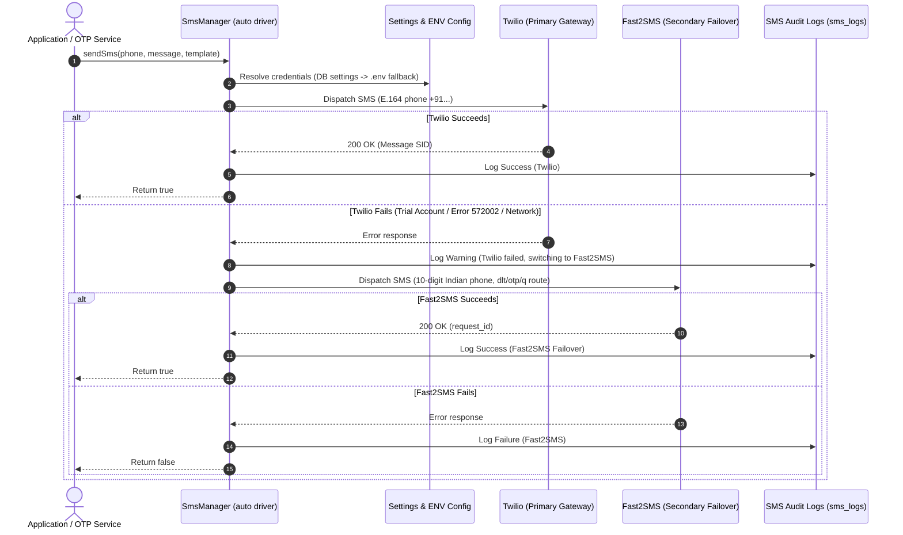

# 📸 Middukhera Studio & Productions — Luxury Photoshoot & Production Management Platform

A high-performance, enterprise-grade Photoshoot & Cinematography Studio web application built with **Laravel 12 / PHP 8.4**, **TailwindCSS v4**, **Alpine.js**, **MySQL**, **Razorpay Payment Gateway**, **Multi-Gateway SMS Engine (Twilio + Fast2SMS Dual-Failover)**, **Phone OTP Verification**, **Package & Booking Management**, **Responsive Executive Sidebar Dashboard**, and **Resilient Asynchronous Webhooks**.

---

## 📑 Table of Contents

1. [🌟 Architecture & System Workflows](#-architecture--system-workflows)
2. [✨ Key Features & Modules](#-key-features--modules)
   - [Executive Super Admin Dashboard](#1-executive-super-admin-dashboard)
   - [Dual-Gateway SMS Engine (Twilio + Fast2SMS Failover)](#2-dual-gateway-sms-engine-twilio--fast2sms)
   - [Package & Portfolio Management (with Edit/Update)](#3-package--portfolio-management)
   - [Phone OTP Verification & Security](#4-phone-otp-verification--security)
   - [Razorpay Payment Gateway & Transaction Tracking](#5-razorpay-payment-gateway--transaction-tracking)
   - [Asynchronous Webhooks & Reliability](#6-asynchronous-webhooks--reliability)
   - [Vendor / Photographer Multi-Tenant System](#7-vendor--photographer-multi-tenant-system)
   - [Dynamic Theme Engine & JSON-LD Structured SEO](#8-dynamic-theme-engine--json-ld-structured-seo)
3. [📂 Project Structure & Architecture](#-project-structure--architecture)
4. [🛠️ Step-by-Step Installation & Local Setup](#️-step-by-step-installation--local-setup)
5. [⚙️ Environment Configuration (`.env`)](#️-environment-configuration-env)
6. [🔑 Default Seed Credentials](#-default-seed-credentials)
7. [📖 How Everything Works (Operational Guide)](#-how-everything-works-operational-guide)
   - [How to Test SMS Gateway & Failover](#a-how-to-test-sms-gateway--failover)
   - [How the Booking & Checkout Flow Works](#b-how-the-booking--checkout-flow-works)
   - [How to Edit and Create Packages](#c-how-to-edit-and-create-packages)
   - [How to Customize Studio Branding & Theme Colors](#d-how-to-customize-studio-branding--theme-colors)
   - [How to Test Razorpay Webhooks Locally](#e-how-to-test-razorpay-webhooks-locally)
8. [🗄️ Database Schema & Data Models](#️-database-schema--data-models)
9. [🧪 Automated Testing & Verification](#-automated-testing--verification)
10. [🚀 Deployment & Production Optimizations](#-deployment--production-optimizations)
11. [❓ Troubleshooting & FAQ](#-troubleshooting--faq)

---

## 🌟 Architecture & System Workflows

### 1. High-Level Booking & Payment Architecture



---

### 2. Dual-Gateway SMS Auto-Failover Sequence



---

## ✨ Key Features & Modules

### 1. Executive Super Admin Dashboard
- **Responsive Sticky Sidebar**: Full-height luxury dark sidebar with smooth slide-over drawer on mobile/tablet (with backdrop blur and tap-to-dismiss) and a desktop Show/Off toggle button.
- **Section Switching without Reload**: Instant Alpine.js section switching across Overview, Bookings, Transactions, Pricing Packages, Portfolio Gallery, Reviews, Messages, SMS Gateways, Theme Customizer, and Webhooks.
- **Dedicated Layout Isolation**: Isolated from the public website navbar and footer to prevent overlapping and ensure an executive workspace feel.
- **Metric Cards & Live Analytics**: Real-time stats for Gross Revenue, Captured Bookings, Transactions, Conversion Rates, and Active Packages.

### 2. Dual-Gateway SMS Engine (Twilio + Fast2SMS)
- **Primary & Secondary Auto-Failover**: Automatically attempts Twilio first and fails over to Fast2SMS if Twilio encounters trial restrictions (e.g. error `572002` unverified recipient number) or API downtime.
- **Dynamic Configuration Resolution**: Settings saved in the Admin Dashboard database take precedence, falling back to `.env` and `config/services.php`.
- **Intelligent Phone Normalization**:
  - `Twilio`: Formats numbers to international **E.164** format (`+919876543210`).
  - `Fast2SMS`: Normalizes Indian numbers to clean **10-digit** format (`9876543210`).
- **Pluggable Drivers**:
  - `auto`: Dual-gateway auto-failover (`Twilio` $\rightarrow$ `Fast2SMS`).
  - `twilio`: Direct Twilio international messaging.
  - `fast2sms`: Direct Fast2SMS (supports `q`, `otp`, `v3`, and `dlt` routes).
  - `msg91`: Enterprise MSG91 Flow API.
  - `custom`: Generic HTTP GET/POST webhook gateway with `{phone}` and `{message}` placeholders.
  - `log`: Local development logger writing to `storage/logs/laravel.log`.
- **SMS Diagnostic Tool**: In-dashboard SMS test console allowing gateway selection, custom recipient, and instant test dispatches with detailed error diagnostics.
- **Template Customizer with Dynamic Placeholders**:
  - `{site_name}`: Studio brand name
  - `{currency}`: Active currency symbol
  - `{name}`: Client full name
  - `{amount}`: Formatted transaction amount
  - `{booking_id}`: Booking ID
  - `{package}`: Photography package name
  - `{payment_id}`: Razorpay payment ID
  - `{otp}`: 6-digit verification code
  - `{reason}`: Failure reason
  - `{retry_url}`: Direct checkout retry link
- **Delivery Audit Trail**: Full transaction logs stored in `sms_logs` table tracking driver used, recipient, message text, status, and raw API response.

### 3. Package & Portfolio Management
- **Package Edit & Update Modal**: Edit package name, minimum and maximum price, description, feature checklists, and upload new cover images or specify image URLs.
- **Multi-Format Image Handling**: Supports direct file uploads stored in `public/storage/packages` as well as external CDN image URLs.
- **Tier Deliverables**: Dynamic JSON feature arrays displayed as checklist badges on checkout and booking cards.
- **Gallery Showcase**: Categorized portfolio items (`Wedding`, `Portrait`, `Fashion`, `Editorial`, `Event`, `Product`) with direct image uploads.

### 4. Phone OTP Verification & Security
- **Cryptographic 6-Digit Codes**: Generated securely with a 10-minute expiry window.
- **Brute-Force & Rate-Limit Protection**: Enforces a maximum of 5 verification attempts per OTP and a 60-second cooldown timer between resend requests.
- **Inline AJAX Verification Box**: Real-time countdown timer, seamless token generation (`otp_token`), and instant validation before payment initiation.

### 5. Razorpay Payment Gateway & Transaction Tracking
- **Complete Transaction State Machine**: Tracks states: `initiated`, `pending_otp`, `otp_verified`, `processing`, `captured`, `failed`, `refunded`.
- **Dual Checkout Modes**:
  - **Live / Test Gateway Mode**: Interactive Razorpay popup with pre-filled customer details and SHA256 signature verification.
  - **1-Click Sandbox Simulation Mode**: Enables instant development and presentation testing without live API keys.
- **Transaction Inspector**: Admin modal with raw gateway JSON payload viewer, status filtering, and search by reference ID (`TRX-XXXXX`).
- **Client Receipt Generation**: Client portal displays live transaction reference codes, payment IDs, status badges, and printable receipts.

### 6. Asynchronous Webhooks & Reliability
- **Dedicated Webhook Routes**: `POST /razorpay/webhook` and `POST /webhooks/razorpay` (CSRF-exempt).
- **HMAC SHA256 Signature Verification**: Validates all incoming payloads against `RAZORPAY_WEBHOOK_SECRET`.
- **Idempotency & Replay Protection**: Eliminates duplicate charges or double updates if Razorpay re-sends events.
- **Handled Events**: `payment.captured`, `order.paid`, `payment.failed`, `payment.authorized`, `refund.created`, `refund.processed`.
- **Admin Webhook Stream**: Real-time event log viewer with JSON payload inspector and 1-click webhook URL copy button.

### 7. Vendor / Photographer Multi-Tenant System
- **Vendor Registration Flow**: Photographers and studio partners can register via `/vendor/register`.
- **Vendor Portal**: Dedicated dashboard at `/vendor/dashboard` for managing custom packages, viewing assigned booking sessions, and tracking client sessions.
- **Admin Moderation**: Super Admin can approve, suspend, or reject vendor applications.

### 8. Dynamic Theme Engine & JSON-LD Structured SEO
- **Live Color & Visual Customizer**: Real-time palette customizer with dark/light background canvas controls (`bg_color`, `card_bg_color`, `primary_color`, `secondary_color`, `accent_color`).
- **6 One-Click Presets**: *Luxury Gold*, *Obsidian Neon*, *Royal Emerald*, *Rose Champagne*, *Cyberpunk Violet*, and *Clean Light*.
- **Structured Schema Markup**: Automated JSON-LD structured data for `PhotographyStudio`, `LocalBusiness`, and `BreadcrumbList`.
- **Dynamic XML Sitemap & Robots**: Live sitemap generated at `/sitemap.xml` and automated `/robots.txt`.

---

## 📂 Project Structure & Architecture

```
Studio/
├── app/
│   ├── Http/
│   │   ├── Controllers/
│   │   │   ├── AdminDashboardController.php     # Admin metrics, settings, packages, SMS tests, theme presets
│   │   │   ├── BookingController.php            # Checkout, Razorpay order creation, payment verification
│   │   │   ├── ClientDashboardController.php    # Client booking history & printable receipts
│   │   │   ├── FrontendController.php           # Public homepage, gallery, blogs, contact, policies
│   │   │   ├── OtpController.php                # AJAX OTP send, verify, and resend endpoints
│   │   │   ├── RazorpayWebhookController.php    # Inbound HMAC-verified webhook handler
│   │   │   ├── SitemapController.php            # Dynamic XML sitemap generator
│   │   │   ├── VendorDashboardController.php    # Vendor analytics & session manager
│   │   │   ├── VendorPackageController.php      # Vendor custom package CRUD
│   │   │   └── VendorRegistrationController.php # Vendor signup and onboard flow
│   │   └── Middleware/
│   │       ├── EnsureAdmin.php                  # Super Admin role authorization gate
│   │       └── VerifyCsrfToken.php              # Webhook route CSRF exemption
│   ├── Models/
│   │   ├── Blog.php                             # Masterclass editorial articles
│   │   ├── Booking.php                          # Photoshoot appointments & workflow state
│   │   ├── ContactMessage.php                   # Public inquiries
│   │   ├── Gallery.php                          # Portfolio images & category tags
│   │   ├── OtpVerification.php                  # 6-digit phone verification tokens
│   │   ├── Package.php                          # Photography packages & pricing
│   │   ├── Payment.php                          # Legacy payment records
│   │   ├── Setting.php                          # Key-value dynamic system configuration
│   │   ├── SmsLog.php                           # Delivery audit trail for SMS dispatches
│   │   ├── Transaction.php                      # Full payment lifecycle & Razorpay metadata
│   │   ├── User.php                             # User accounts (super_admin, vendor, client)
│   │   ├── Vendor.php                           # Photographer partner profile
│   │   ├── Visitor.php                          # Analytics visitor tracker
│   │   └── WebhookLog.php                       # Inbound webhook payload logs
│   └── Services/
│       ├── Otp/
│       │   └── OtpService.php                   # OTP generation, verification, and rate limiting
│       ├── Payment/
│       │   └── RazorpayService.php              # Razorpay API client, orders, signature verification
│       └── Sms/
│           ├── Contracts/
│           │   └── SmsGatewayInterface.php      # Driver interface contract
│           ├── Drivers/
│           │   ├── AutoFailoverDriver.php       # Primary (Twilio) -> Secondary (Fast2SMS) failover
│           │   ├── CustomHttpDriver.php         # Generic HTTP webhook driver
│           │   ├── Fast2SmsDriver.php           # Fast2SMS gateway driver (India 10-digit)
│           │   ├── LogDriver.php                # Local file logger driver
│           │   ├── Msg91Driver.php              # MSG91 Flow API driver
│           │   └── TwilioDriver.php             # Twilio SMS gateway driver (E.164)
│           └── SmsManager.php                   # Factory & dynamic config resolution engine
├── config/
│   ├── database.php                             # Database connections
│   ├── services.php                             # Service credentials (Razorpay, Twilio, Fast2SMS, MSG91)
│   └── sms.php                                  # Default SMS drivers & templates
├── database/
│   ├── migrations/
│   │   ├── 0001_01_01_000000_create_users_table.php
│   │   ├── 2026_08_11_000000_create_photoshoot_studio_tables.php
│   │   ├── 2026_08_11_100000_create_vendors_and_update_packages.php
│   │   ├── 2026_08_14_190241_create_settings_table.php
│   │   └── 2026_08_21_000000_create_transactions_otp_sms_webhook_tables.php
│   └── seeders/
│       └── DatabaseSeeder.php                   # Complete default settings, packages, blogs, users
├── resources/
│   ├── css/
│   │   └── app.css                              # TailwindCSS v4 theme variables
│   └── views/
│       ├── admin/
│       │   └── dashboard.blade.php              # Executive responsive sidebar admin dashboard
│       ├── booking/
│       │   └── checkout.blade.php               # Luxury checkout screen with OTP & Razorpay
│       ├── client/
│       │   └── dashboard.blade.php              # Client reservations & transaction receipts
│       ├── frontend/
│       │   ├── about.blade.php
│       │   ├── blog.blade.php
│       │   ├── contact.blade.php
│       │   ├── gallery.blade.php
│       │   ├── home.blade.php                   # Landing page with hero, packages & reviews
│       │   └── policies.blade.php               # Terms, Privacy, Refund, Shipping compliance
│       ├── layouts/
│       │   ├── app.blade.php                    # Master layout with conditional admin separation
│       │   ├── footer.blade.php                 # Public footer
│       │   └── navigation.blade.php             # Public luxury navigation bar
│       └── vendor/
│           └── dashboard.blade.php              # Vendor dashboard
├── routes/
│   ├── auth.php                                 # Authentication routes (Breeze)
│   └── web.php                                  # Main web & API routes
└── tests/
    └── Feature/
        ├── Auth/                                # User authentication tests
        ├── PackageManagementTest.php            # Package CRUD & update tests
        └── SmsGatewayTest.php                   # Twilio, Fast2SMS, Auto-failover & template tests
```

---

## 🛠️ Step-by-Step Installation & Local Setup

### Prerequisites
Ensure your local environment meets the following requirements:
- **PHP**: `^8.2` or `^8.4` (with `pdo_mysql`, `curl`, `mbstring`, `openssl`, `fileinfo` extensions enabled)
- **Composer**: `^2.x`
- **Node.js**: `^18.x` or `^20.x` & **NPM**
- **MySQL / MariaDB**: `^8.0` / `^10.4` (e.g. via XAMPP)
- **Web Server**: Apache / Nginx or Laravel built-in CLI server

---

### Step 1: Open Project Directory
```bash
cd c:\xampp\htdocs\vk\Studio
```

### Step 2: Install PHP Dependencies
```bash
composer install
```

### Step 3: Install Frontend Node Dependencies & Compile Assets
```bash
npm install
npm run build
```
*(For active local development with hot reload, run `npm run dev` in a separate terminal).*

### Step 4: Configure Environment File
Copy `.env.example` to `.env` if it doesn't already exist:
```bash
cp .env.example .env
```
Generate an application encryption key:
```bash
php artisan key:generate
```

### Step 5: Configure Database & API Credentials
Open `.env` and configure your MySQL database connection:
```env
DB_CONNECTION=mysql
DB_HOST=127.0.0.1
DB_PORT=3306
DB_DATABASE=studio
DB_USERNAME=root
DB_PASSWORD=
```

### Step 6: Run Database Migrations & Seeds
Run the database migrations and seed the database with packages, blogs, settings, and default user accounts:
```bash
php artisan migrate --seed
```

### Step 7: Create Public Storage Symlink
Link the `storage/app/public` directory to `public/storage` so package uploads and gallery images are web-accessible:
```bash
php artisan storage:link
```

### Step 8: Start the Local Development Server
```bash
php artisan serve
```
Open your browser and navigate to:
```
http://127.0.0.1:8000
```

---

## ⚙️ Environment Configuration (`.env`)

Below is the complete reference of environment variables used by the system:

```env
# ==============================================================================
# APPLICATION SETTINGS
# ==============================================================================
APP_NAME="Middukhera Studio & Productions"
APP_ENV=local
APP_KEY=base64:...
APP_DEBUG=true
APP_TIMEZONE=Asia/Kolkata
APP_URL=http://127.0.0.1:8000

# ==============================================================================
# DATABASE CONFIGURATION
# ==============================================================================
DB_CONNECTION=mysql
DB_HOST=127.0.0.1
DB_PORT=3306
DB_DATABASE=studio
DB_USERNAME=root
DB_PASSWORD=

# ==============================================================================
# RAZORPAY PAYMENT GATEWAY
# ==============================================================================
# In simulation mode (1), test payments succeed instantly without calling live APIs
RAZORPAY_SIMULATION_MODE=1
RAZORPAY_KEY_ID=rzp_test_sample
RAZORPAY_KEY_SECRET=your_razorpay_secret
RAZORPAY_WEBHOOK_SECRET=your_webhook_secret

# ==============================================================================
# SMS MULTI-GATEWAY CONFIGURATION
# Options: auto (Twilio -> Fast2SMS), twilio, fast2sms, msg91, custom, log
# ==============================================================================
SMS_DRIVER=auto

# Gateway 1: Twilio (Primary Gateway)
TWILIO_SID=ACXXXXXXXXXXXXXXXXXXXXXXXXXXXXXXXX
TWILIO_AUTH_TOKEN=your_twilio_auth_token
TWILIO_FROM=+1234567890

# Gateway 2: Fast2SMS (Secondary Failover Gateway for India)
FAST2SMS_API_KEY=your_fast2sms_api_key
FAST2SMS_ROUTE=q
FAST2SMS_SENDER_ID=FSTSMS
FAST2SMS_ENTITY_ID=

# Gateway 3: MSG91 (Optional Flow Gateway)
MSG91_AUTH_KEY=
MSG91_FLOW_ID=
MSG91_SENDER_ID=

# Gateway 4: Custom HTTP Gateway (Optional)
SMS_CUSTOM_HTTP_URL="https://api.custom-sms.com/send?to={phone}&msg={message}"
SMS_CUSTOM_HTTP_METHOD=GET
```

---

## 🔑 Default Seed Credentials

After running `php artisan migrate --seed`, use the following pre-configured user accounts:

| Role | Email | Password | Default Dashboard URL | Permissions & Capabilities |
|---|---|---|---|---|
| **Super Admin** | `admin@studio.test` | `password` | `/admin/dashboard` | Full system control, SMS testing, Package editing, Theme styling, Webhooks, Transactions |
| **Vendor / Photographer** | `vendor@studio.test` | `password` | `/vendor/dashboard` | Manage custom packages, view assigned shoot sessions |
| **Client / Customer** | `client@studio.test` | `password` | `/client/dashboard` | View booking reservations, download receipts, track payments |

---

## 📖 How Everything Works (Operational Guide)

### A. How to Test SMS Gateway & Failover
1. Log in to the **Admin Dashboard** (`/admin/dashboard`) as `admin@studio.test`.
2. Click on the **SMS Gateway** menu item on the left sidebar.
3. In the **Gateway Provider Configuration** panel, select:
   - **`Automatic Failover (Twilio -> Fast2SMS)`** to test the dual-gateway pipeline.
   - Or select **`Twilio`** or **`Fast2SMS`** directly to test an isolated provider.
4. Enter your credentials in the input fields (or leave them to use values from `.env`).
5. In the **"Send Test SMS"** card:
   - Enter your mobile number (e.g. `9876543210` or `+919876543210`).
   - Select the test gateway (`auto`, `twilio`, `fast2sms`).
   - Enter your test message text and click **Dispatch Test Message**.
6. The system displays a live status badge:
   - If Twilio succeeds, it confirms delivery with Twilio SID.
   - If Twilio encounters trial restrictions (Error 572002), the system automatically attempts Fast2SMS and displays: *"Primary gateway (twilio) failed. Auto-failover to fast2sms succeeded."*
7. Inspect the **SMS Transmission Audit Logs** table at the bottom of the page to review the full payload history.

---

### B. How the Booking & Checkout Flow Works
1. Navigate to the public homepage (`/`) and click on any package (e.g., **Signature Portraiture**).
2. Click **Reserve Package & Proceed to Checkout**.
3. On the checkout screen:
   - Select your preferred shoot date and time slot.
   - Enter your Full Name, Email, and Mobile Phone Number.
4. Click **"Send Verification OTP"**:
   - The system triggers an AJAX request to `/otp/send`.
   - A 6-digit verification code is dispatched to the user's phone via the active SMS engine.
   - *(In development / simulation mode, the OTP code is auto-filled for instant testing).*
5. Enter the 6-digit OTP code and click **Verify Code**.
6. Once verified, the **"Proceed to Secure Payment"** button is unlocked.
7. Click the payment button:
   - A Razorpay payment modal opens with pre-filled amount and client info.
   - Complete the payment (or use Sandbox 1-Click Simulation).
8. The client is redirected to the confirmation screen with a unique tracking reference (e.g. `TRX-94DF8E2A`) and a confirmation SMS is automatically dispatched.

---

### C. How to Edit and Create Packages
1. Open the Admin Dashboard sidebar and click **Pricing Packages**.
2. To edit an existing package:
   - Click the **Edit Package** button on any package card.
   - The **"Edit Package"** modal appears.
   - Modify the Name, Minimum Price, Maximum Price, or Description.
   - Enter comma-separated features (e.g. `90-min shoot, 20 Edited Photos, Hair Stylist`).
   - Upload a new cover image from your computer or provide an image URL.
   - Click **Save Package Changes**.
3. To create a new package:
   - Use the **"Create Signature Package"** form at the top of the section.
   - Fill in details, upload an image, and click **Publish Package**.

---

### D. How to Customize Studio Branding & Theme Colors
1. Open the Admin Dashboard sidebar and click **Theme Customizer**.
2. **Apply 1-Click Presets**:
   - Select from *Luxury Gold*, *Obsidian Neon*, *Royal Emerald*, *Rose Champagne*, *Cyberpunk Violet*, or *Clean Light*.
3. **Manual Customization**:
   - Adjust the **Canvas Background Color** (`bg_color`), **Card Background** (`card_bg_color`), **Primary Gold Accent**, and **Secondary Accent**.
   - Edit Studio Brand Name, Tagline, Phone, Email, and Social Media links.
4. Click **Save System Configurations**. The entire website updates in real-time across all public and client views.

---

### E. How to Test Razorpay Webhooks Locally
1. Start local tunnel with ngrok (or similar):
   ```bash
   ngrok http 8000
   ```
2. In your **Razorpay Dashboard** $\rightarrow$ **Settings** $\rightarrow$ **Webhooks**:
   - Webhook URL: `https://your-ngrok-subdomain.ngrok-free.app/razorpay/webhook`
   - Secret: Enter your `RAZORPAY_WEBHOOK_SECRET`
   - Active Events: `payment.captured`, `payment.failed`, `order.paid`, `refund.created`
3. In the Admin Dashboard under **Razorpay Webhooks**, monitor incoming webhook events in real-time with full JSON payload inspection.

---

## 🗄️ Database Schema & Data Models

| Table Name | Primary Responsibilities | Key Columns |
|---|---|---|
| `users` | User authentication & role management | `id`, `name`, `email`, `role` (`super_admin`, `vendor`, `client`), `password`, `created_at` |
| `packages` | Photoshoot tiers & pricing deliverables | `id`, `vendor_id`, `name`, `slug`, `price_min`, `price_max`, `description`, `features` (JSON), `image_path` |
| `bookings` | Customer session appointments | `id`, `user_id`, `package_id`, `vendor_id`, `booking_date`, `time_slot`, `status`, `total_amount`, `notes` |
| `transactions` | Complete payment tracking & Razorpay audit | `id`, `transaction_ref`, `booking_id`, `user_id`, `amount`, `status`, `payment_method`, `razorpay_order_id`, `razorpay_payment_id`, `razorpay_signature`, `raw_response` (JSON) |
| `otp_verifications` | 6-digit phone verification records | `id`, `phone`, `email`, `otp_code`, `token`, `status`, `attempts`, `expires_at`, `verified_at` |
| `sms_logs` | Outbound SMS transmission audit trail | `id`, `recipient`, `message`, `driver`, `template_key`, `status`, `response_payload` (JSON), `created_at` |
| `webhook_logs` | Inbound Razorpay webhook stream | `id`, `event_id`, `event_type`, `signature`, `is_valid_signature`, `processed`, `payload` (JSON) |
| `settings` | Dynamic system settings & theme values | `id`, `key`, `value`, `created_at`, `updated_at` |
| `galleries` | Portfolio imagery & category tags | `id`, `title`, `category`, `image_path`, `created_at` |
| `blogs` | Editorial masterclasses & SEO articles | `id`, `title`, `slug`, `excerpt`, `content`, `image_path`, `meta_title`, `meta_description` |
| `vendors` | Photographer partners & studio profiles | `id`, `user_id`, `name`, `slug`, `description`, `status` (`pending`, `approved`, `rejected`) |
| `contact_messages` | Public contact & inquiry submissions | `id`, `name`, `email`, `phone`, `subject`, `message`, `is_read` |

---

## 🧪 Automated Testing & Verification

The project includes an automated test suite verifying authentication, SMS gateway failovers, package CRUD operations, and payment lifecycles.

### Run the Test Suite
```bash
php artisan test
```

### Test Coverage Highlights
- `tests/Feature/SmsGatewayTest.php`:
  - Validates `TwilioDriver` E.164 phone formatting and API dispatch.
  - Validates `Fast2SmsDriver` 10-digit sanitization and error payload handling.
  - Validates `AutoFailoverDriver` automatic failover logic (primary failure $\rightarrow$ secondary success).
  - Validates SMS template interpolation (`{site_name}`, `{otp}`, `{amount}`).
  - Validates `sms_logs` audit recording.
- `tests/Feature/PackageManagementTest.php`:
  - Validates package creation, image file uploads, price updates, and deletion.
  - Validates Super Admin authorization rules and unauthorized access restrictions.
- `tests/Feature/Auth/*`:
  - Validates client and vendor registration, login, password resets, and role redirection.

---

## 🚀 Deployment & Production Optimizations

When deploying to a production server (Ubuntu/Debian, Forge, cPanel, or VPS):

### 1. Optimize Laravel Caches
```bash
php artisan config:cache
php artisan route:cache
php artisan view:cache
php artisan event:cache
```

### 2. Set Production Environment
In your production `.env`:
```env
APP_ENV=production
APP_DEBUG=false
APP_URL=https://yourdomain.com
```

### 3. File Permissions
Ensure the web server has write permissions to `storage` and `bootstrap/cache`:
```bash
sudo chown -R www-data:www-data storage bootstrap/cache
sudo chmod -R 775 storage bootstrap/cache
```

### 4. Nginx Server Block Example
```nginx
server {
    listen 80;
    listen [::]:80;
    server_name yourdomain.com www.yourdomain.com;
    return 301 https://$host$request_uri;
}

server {
    listen 443 ssl http2;
    listen [::]:443 ssl http2;
    server_name yourdomain.com www.yourdomain.com;
    root /var/www/Studio/public;

    ssl_certificate /etc/letsencrypt/live/yourdomain.com/fullchain.pem;
    ssl_certificate_key /etc/letsencrypt/live/yourdomain.com/privkey.pem;

    add_header X-Frame-Options "SAMEORIGIN";
    add_header X-Content-Type-Options "nosniff";

    index index.php;
    charset utf-8;

    location / {
        try_files $uri $uri/ /index.php?$query_string;
    }

    location = /favicon.ico { access_log off; log_not_found off; }
    location = /robots.txt  { access_log off; log_not_found off; }

    error_page 404 /index.php;

    location ~ \.php$ {
        fastcgi_pass unix:/var/run/php/php8.4-fpm.sock;
        fastcgi_param SCRIPT_FILENAME $realpath_root$fastcgi_script_name;
        include fastcgi_params;
    }

    location ~ /\.(?!well-known).* {
        deny all;
    }
}
```

---

## ❓ Troubleshooting & FAQ

#### Q1: Why did Twilio return error `[572002]`?
**A**: When using a **Twilio Trial Account**, Twilio restricts outbound SMS only to numbers that have been verified in your Twilio Console under **"Verified Caller IDs"**. 
Our **Dual-Gateway Auto-Failover** automatically detects this error and immediately routes the SMS via **Fast2SMS** so your customer still receives their message seamlessly. To send to any number on Twilio, upgrade your Twilio account from Trial to Full.

#### Q2: Fast2SMS returns `Invalid API Key` or `Route error`?
**A**:
1. Check that your Fast2SMS API key is active in your Fast2SMS wallet.
2. In India, Fast2SMS uses route `q` (Quick SMS) for general testing or `otp` / `dlt` for registered DLT templates. Ensure `FAST2SMS_ROUTE=q` in `.env` or in Admin Settings.

#### Q3: Uploaded package images are broken or not loading?
**A**: Run `php artisan storage:link` to create the symbolic link between `storage/app/public` and `public/storage`.

#### Q4: How do I test payments without live Razorpay credentials?
**A**: Set `RAZORPAY_SIMULATION_MODE=1` in `.env` or enable **Simulation Mode** in Admin Dashboard $\rightarrow$ Settings. The checkout screen will allow 1-Click test captures.

---

## 📄 License & Credits

- **Platform**: Developed for **Middukhera Studio & Productions**.
- **Framework**: [Laravel](https://laravel.com) by Taylor Otwell.
- **Icons**: [Lucide Icons](https://lucide.dev).
- **Styling**: [TailwindCSS](https://tailwindcss.com) & [Alpine.js](https://alpinejs.dev).

---
*Crafted with precision for luxury photoshoot and cinematography management.*
